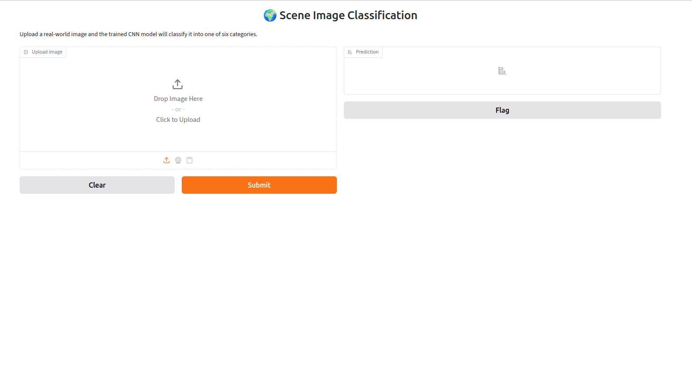

# ANN vs CNN — Image Classification

## 1. Project Overview

This project compares a fully connected Artificial Neural
Network (ANN) with a Convolutional Neural Network (CNN) for
real-world image classification.

## 2. Dataset

Dataset:
Intel Image Classification

Classes:
- Buildings
- Forest
- Glacier
- Mountain
- Sea
- Street

Dataset Source:
Kaggle

## 3. ANN

Input:
128 × 128 × 3

Preprocessing:
- Resize
- Normalize
- Flatten

Architecture:
Flatten
Dense(512)
Dense(256)
Dense(128)
Dense(6)

## 4. CNN

Architecture:
Conv2D
MaxPooling
Conv2D
MaxPooling
Conv2D
MaxPooling
Flatten
Dense
Dense

## 5. Results

| Model | Test Accuracy | Test Loss |
|------|---------------|-----------|
| ANN | 0.405333 | 1.484236 |
| CNN | 0.822000	 | 0.985736 |

## 6. Comparison

There is more accuracy while using CNN.

## 7. Deployment

The winning model was deployed using Gradio.

## 8. Gradio Screenshot

## 9. Technologies

- Python
- TensorFlow
- Keras
- NumPy
- Pandas
- Matplotlib
- Gradio
- Google Colab

## 10. Author

Susanth K S
